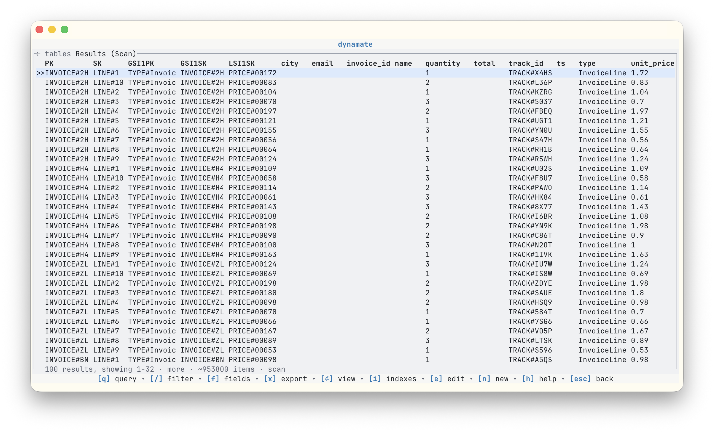

# dynamate

<p align="center">
  
</p>

<p align="center">
  
</p>

`dynamate` is a terminal UI for exploring and querying DynamoDB tables.

## Quick start

Install with Homebrew:

```bash
brew install fiam/dynamate/dynamate
```

If Homebrew reports the formula as unavailable, the tap formula has not been
published yet. In that case, use the release binaries below.

Launch the TUI (it opens with a table selector):

```bash
dynamate
```

You can also jump straight into a table:

```bash
dynamate --table orders-prod
```

`dynamate` is primarily a TUI and works without arguments. Passing `--table`
is optional and only preselects a table at startup.

## AWS authentication and configuration

`dynamate` reads AWS credentials and region from the same standard environment
variables used by AWS CLI v2, including:

- `AWS_ACCESS_KEY_ID`
- `AWS_SECRET_ACCESS_KEY`
- `AWS_SESSION_TOKEN`
- `AWS_REGION` / `AWS_DEFAULT_REGION`

For local endpoints (for example DynamoDB Local), use the AWS CLI v2-style
`--endpoint-url` flag:

```bash
dynamate --endpoint-url http://localhost:8000
```

## Query syntax

In the TUI query box, `dynamate` accepts a compact expression syntax and
automatically chooses a table `Query`, secondary-index `Query`, or `Scan`
depending on the expression and table schema.

See [`QUERY_SYNTAX.md`](QUERY_SYNTAX.md) for syntax, shortcuts, and Query/Scan
behavior.

## Alternative installation options

Install from release binaries:

1. Download the right archive from
   [GitHub Releases](https://github.com/fiam/dynamate/releases).
2. Extract it and put `dynamate` on your `PATH`.

Run with Docker:

```bash
docker run --rm -it ghcr.io/fiam/dynamate:latest
```

Build and install from source:

```bash
git clone https://github.com/fiam/dynamate.git
cd dynamate
cargo install --path .
```

## Run in browser with ttyd

Run with Docker + `ttyd` and a DynamoDB Local container on the same network:

```bash
docker network create dynamate

docker run -d --rm \
  --name dynamodb \
  --network dynamate \
  -p 8000:8000 \
  amazon/dynamodb-local:2.5.2 \
  -jar DynamoDBLocal.jar -sharedDb
```

Then run Dynamate:

```bash
docker run --rm \
  --network dynamate \
  -p 7681:7681 \
  -e DYNAMATE_USE_TTYD=1 \
  -e TTYD_PORT=7681 \
  -e AWS_REGION=us-east-1 \
  -e AWS_ACCESS_KEY_ID=local \
  -e AWS_SECRET_ACCESS_KEY=local \
  ghcr.io/fiam/dynamate:latest \
  --endpoint-url http://dynamodb:8000
```

Then open `http://localhost:7681` in your browser.

## Non-TUI commands

List tables:

```bash
dynamate list-tables
dynamate list-tables --json
```

Create a table:

```bash
dynamate create-table --table demo --pk PK:S
dynamate create-table --table demo --pk PK:S --sk SK:S
```

Create a table with indexes:

```bash
dynamate create-table \
  --table demo \
  --pk PK:S \
  --sk SK:S \
  --gsi GSI1:GSI1PK:S \
  --gsi GSI2:GSI2PK:N:GSI2SK:S:include=owner,status \
  --lsi LSI1:LSI1SK:S:keys_only
```

Projection tokens are `all`, `keys_only`, or `include=attr1,attr2`.

## Developer docs

- [`DEVELOPING.md`](DEVELOPING.md)
- [`docs/CI.md`](docs/CI.md)
- [`docs/RELEASING.md`](docs/RELEASING.md)
